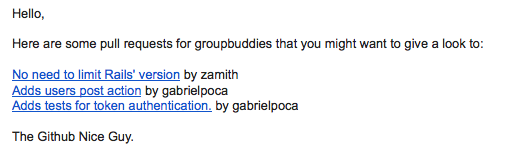

# Github Nice Guy

Let's face it, open pull requests are forgotten. It can happen for a multitude
of reasons ranging from losing interest in the project to a comment that was
never answered.

Github Nice Guy is a small script that fetches the open pull requests for a
given user (or organization) and sends a weekly friendly reminder with links to them to
whoever you think should know about it.

This is how it looks:



## Getting Started

The best way to get Github Nice Guy up and running is to clone this repo into a
server.

```
cd /any/path/you/like
git clone git@github.com:zamith/github-nice-guy.git
```

## Configuration

All the configuration is done through environment variables. Albeit possible to
use `export` to set all the variables, [dotenv](https://github.com/bkeepers/dotenv) has
been added for convenience.

If you've never used dotenv, what it does is read from a `.env` file and load
all the variables in there into environment variables. A Github Nice Guy
configuration file looks like this:

```
GITHUB_BASIC_AUTH=username:password
SEARCH_USER=user_or_orgnization_name
RECIPIENTS=one@example.com,two@example.com
SMTP_ADDRESS=smtp_address # e.g. smtp.gmail.com
SMTP_DOMAIN=smtp_domain # e.g. gmail.com
SMTP_PORT=smtp_port # e.g. 587
SMTP_USERNAME=smtp_username
SMTP_PASSWORD=smtp_password
SMTP_AUTH=smtp_auth # e.g. plain
```

`GITHUB_BASIC_AUTH` is optional, it is only needed if you want to search through
private repos as well.

`SMTP_ADDRESS`, `SMTP_DOMAIN`, `SMTP_PORT` and `SMTP_AUTH` will take the
defaults in the comments if none are passed.

## Running it

Once the configuration is done, you should be able to run it:

```
export RUN=true; bundle exec ruby github_nice_guy.rb
```

By default the script does not do anything when ran, thus the setting of the
`RUN` variable. To make it go back to it's former behaviour, unset the variable.

```
unset RUN
```

*Note:* The API call and emails are being sent from the same process of the
program, so it may take a minute or two, depending on your connection.

### Cron jobs

The best way to have a server execute a repeating job is to schedule it as a
cron job.

To help with that, Github Nice Guy uses
[whenever](https://github.com/javan/whenever). You can change the file at
`config/schedule.rb` as you prefer (or leave it as is), and when you're done
run:

```
bundle exec whenever -w github_nice_guy
```

That should do it. If you didn't change the schedule you'll be getting an email
every day at 9 am local time to the server.

# License

The MIT License (MIT)

Copyright (c) 2014-2015 Luis Zamith Ferreira

Permission is hereby granted, free of charge, to any person obtaining a copy
of this software and associated documentation files (the "Software"), to deal
in the Software without restriction, including without limitation the rights
to use, copy, modify, merge, publish, distribute, sublicense, and/or sell
copies of the Software, and to permit persons to whom the Software is
furnished to do so, subject to the following conditions:

The above copyright notice and this permission notice shall be included in
all copies or substantial portions of the Software.

THE SOFTWARE IS PROVIDED "AS IS", WITHOUT WARRANTY OF ANY KIND, EXPRESS OR
IMPLIED, INCLUDING BUT NOT LIMITED TO THE WARRANTIES OF MERCHANTABILITY,
FITNESS FOR A PARTICULAR PURPOSE AND NONINFRINGEMENT. IN NO EVENT SHALL THE
AUTHORS OR COPYRIGHT HOLDERS BE LIABLE FOR ANY CLAIM, DAMAGES OR OTHER
LIABILITY, WHETHER IN AN ACTION OF CONTRACT, TORT OR OTHERWISE, ARISING FROM,
OUT OF OR IN CONNECTION WITH THE SOFTWARE OR THE USE OR OTHER DEALINGS IN
THE SOFTWARE.
